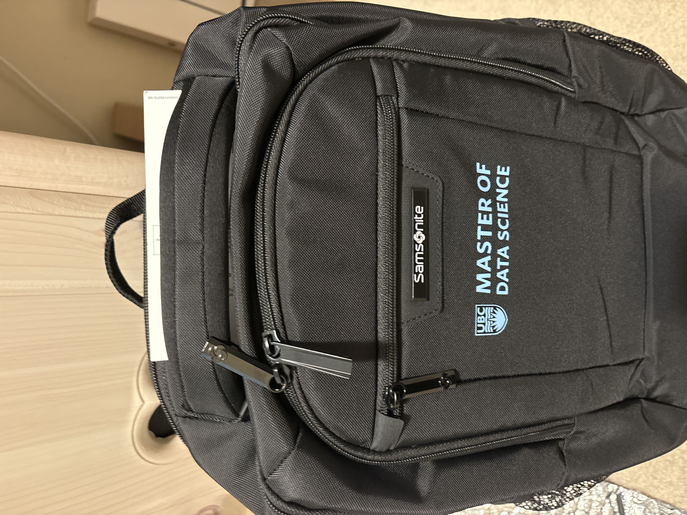

My first week at MDS picked up quite quickly. The orientation flooded my mind with information, and
though I knew this program was growing, I was quite surprised at how many members this cohort contained.
Despite the size of the cohort, I was already meeting wonderful people I would walk with throughout my time at MDS.

The first week of classes flew by even faster. Many assignments to submit, several ways to submit them, and a growing list of things to remember for each class. But by the end of the week, I was feeling accomplished at how much I had learned already. It felt like I learned more in one week than my past summer before the program. 

Now, I'm feeling excited to continue learning and have a chance to test it with the upcoming quizzes. Hopefully that gives me a better understanding of how each block runs throughout the program!

